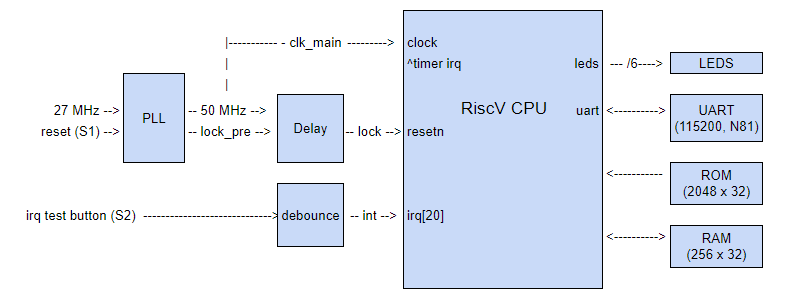
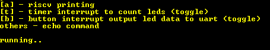

## __PicoRV on Tang9K__

### Simple PicoRV on TangNano 9K
* Gowin GW1NR-LV9QN88PC6/I5
* interrupts: timer & button
* basic uart with print functions
* /fw directory contains demo code

### Build instructions:
1.  run make in /fw directory to generate rom.v
2.  build system with Gowin FPGA Designer software
3.  download bitstream to FPGA

### Usage:
1. After downloading FPGA bitstream to Tang Nano board, connect comm port 115200 N81	
2. Press "S1" Reset button on Tang Nano.  Onboard LEDs will light up in the following sequence

	1. **110011** defined in top.v

	2. **000011** -> **000010** -> **000001** -> **000000** bootload_check in start.S

	3. **101010** bootload_check done, before calling main in main.c

3. Serial port display on reset

	

	[a] - displays "_Gowin Tang9k [RiscV]_"

	[t] - 1 second timer interrupt incrementing LEDs (toggles)

	[b] - enable/disable "S2" button interrupt.  Internal LED counter will be printed to the comm port when S2 is pressed

### Todo
* bootloader sdcard support to avoid re-synthsis on fw change

btko - Jul 2022